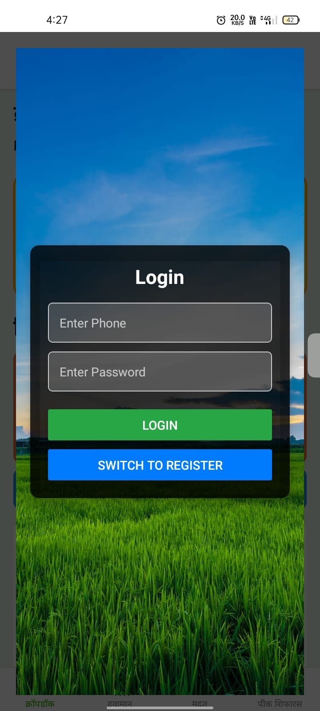
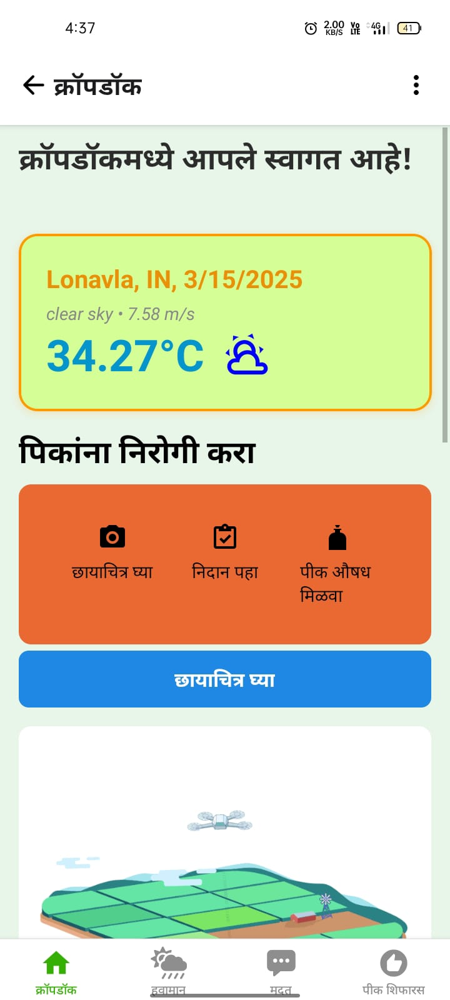
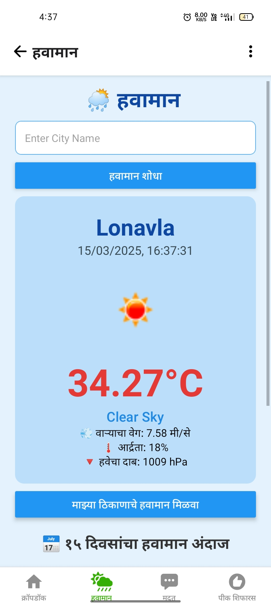
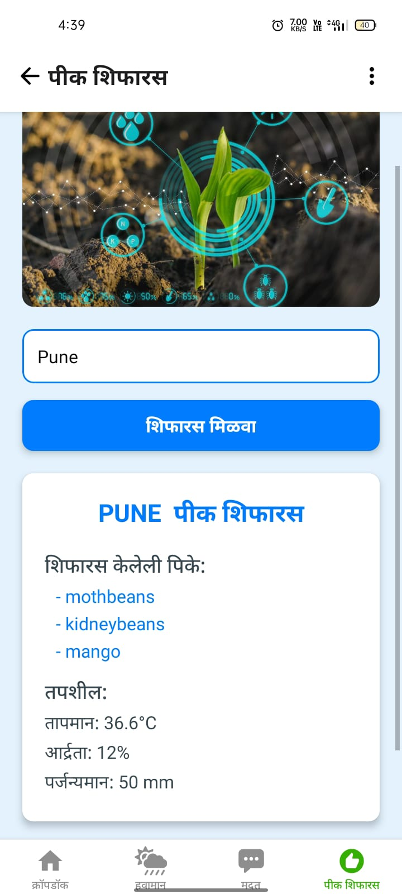
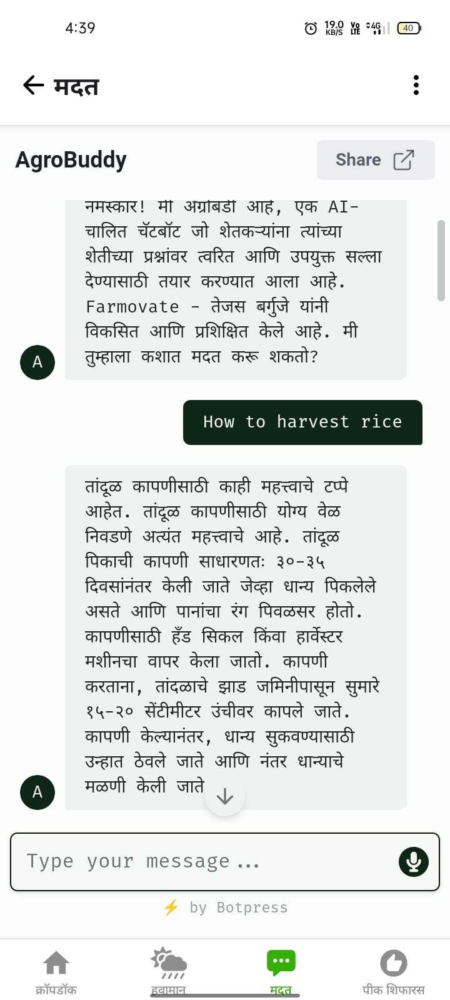
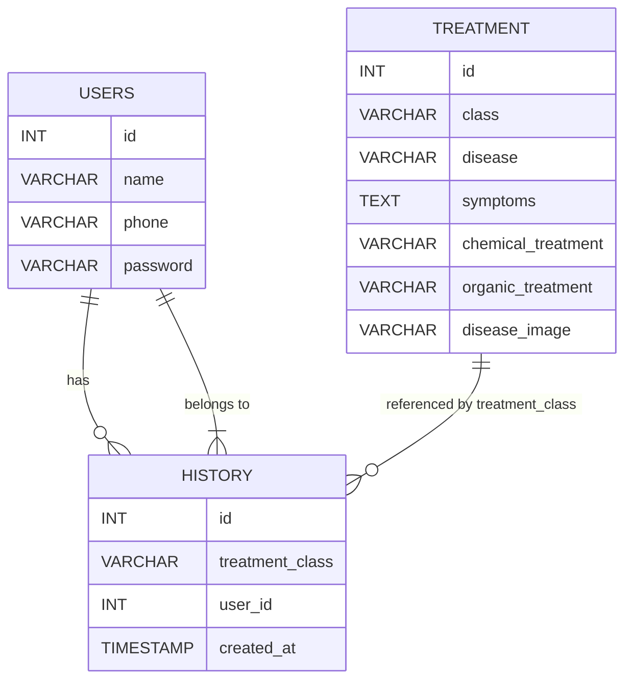
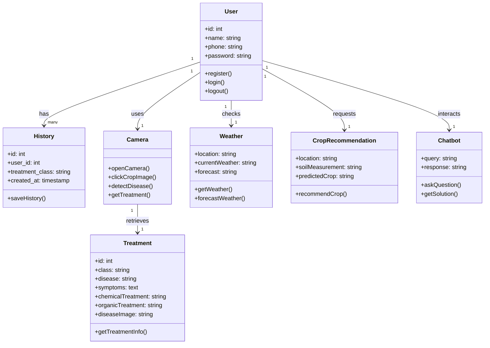

# CropDoc

CropDoc is a comprehensive mobile application designed to help farmers and agricultural enthusiasts manage crop health and get timely recommendations. The app offers various features including crop disease detection, weather updates, crop recommendations, and an AI-based chatbot for additional assistance.

## Screenshots  

### **Login Screen**  
  

### **Disease Detection**  
  

### **Weather Forecast**  
  

### **Crop Recommendation**  
  

### **Chatbot**  
  


## Features

- **User Authentication**: Secure registration, login, and logout functionality.
- **Disease Detection**: 
  - Open the camera and capture a crop image.
  - Automatically detect diseases and retrieve corresponding treatment details.
  - Save detection history for future reference.
- **Weather Updates**:
  - Get current weather data by entering a city or using live location.
  - View a 15-day weather forecast.
- **Crop Recommendation**:
  - Input your city or location along with soil measurements.
  - Receive crop recommendations based on current weather conditions.
- **Chatbot Assistance**:
  - Ask questions and receive solutions powered by advanced AI.

## Architecture Overview

CropDoc is built with a modular approach, ensuring clear separation of concerns between different functionalities. Below are some high-level diagrams to illustrate the architecture:

### ER Diagram



### Class Diagram



## Getting Started

### Prerequisites

- **Frontend**: Node.js and npm
- **Backend**: Your preferred backend language (e.g., Python, Node.js, Java)
- **Database**: MySQL, PostgreSQL, or similar
- **Additional**: API keys for weather data and any AI integrations

### Installation

1. **Clone the Repository**

    ```bash
    git clone https://github.com/yourusername/cropdoc.git
    cd cropdoc
    ```

2. **Install Dependencies**

    - For the frontend:
      ```bash
      cd frontend
      npm install
      ```
    - For the backend:
      ```bash
      cd backend
      pip install -r requirements.txt
      ```

3. **Configure Environment Variables**

    - Create a `.env` file in your backend directory.
    - Set your database credentials, API keys, and any other necessary configuration.

4. **Run the Application**

    - Start the backend server:
      ```bash
      cd backend
      npm start  # or your respective command, e.g., python manage.py runserver
      ```
    - Start the frontend:
      ```bash
      cd frontend
      npm start
      ```

## Usage

- **Registration & Login**: Create an account or log in using your credentials.
- **Disease Detection**: 
  - Open the Camera tab.
  - Capture an image of your crop.
  - Get disease detection results and treatment suggestions.
- **Weather Forecast**: 
  - Navigate to the Weather tab.
  - Enter your city or allow location access to view current weather and a 15-day forecast.
- **Crop Recommendation**:
  - Go to the Crop Recommendation tab.
  - Provide location and soil measurement details to receive crop suggestions.
- **Chatbot**:
  - Open the Chatbot tab.
  - Enter your query to receive an AI-generated response.
- **Logout**: End your session securely.

## Contributing

Contributions are welcome! Please follow these steps:

1. Fork the repository.
2. Create a new branch (`git checkout -b feature/YourFeature`).
3. Commit your changes (`git commit -m 'Add some feature'`).
4. Push to the branch (`git push origin feature/YourFeature`).
5. Open a Pull Request.

## License

This project is licensed under the [MIT License](LICENSE).

## Contact Details

- **Sarthak Nimble**  
  - ✉️ Email: [sarthknimble@outlook.com](mailto:sarthknimble@outlook.com)  
  - 🐙 GitHub: [sarthak-13N](https://github.com/sarthak-13N)  
  - 🔗 LinkedIn: [Sarthak Nimble](https://www.linkedin.com/in/sarthak-nimble1642)  

- **Bhagyalaxmi Bamungi**  
  - ✉️ Email: bhagyalaxmib2004j2@gmail.com  
  - 🐙 GitHub: [GitHub Profile](https://github.com/Bhagyalaxmi-24)  
  - 🔗 LinkedIn: [LinkedIn Profile](https://www.linkedin.com/in/bhagyalaxmi-bamungi-132685265)  

- **Tejas Barguje**  
  - ✉️ Email: [tejasbarguje9@gmail.com](mailto:tejasbarguje9@gmail.com)  
  - 🐙 GitHub: [GitHub Profile](https://github.com/tejasbargujepatil)  
  - 🔗 LinkedIn: [LinkedIn Profile](https://www.linkedin.com/in/tejas-cybersecurityanalyst-)  

- **Shravani Kindre**  
  - ✉️ Email: shravanikindre09@gmail.com  
  - 🐙 GitHub: [GitHub Profile](https://github.com/Shravani05-tech)  
  - 🔗 LinkedIn: [LinkedIn Profile](https://www.linkedin.com/in/shravani-kindre-2b4a67339)  


Happy coding and farming with CropDoc!

This **README** provides an overview, installation instructions, usage details, and information on how to contribute. Feel free to adjust sections, diagrams, and commands according to your project's specifics.
